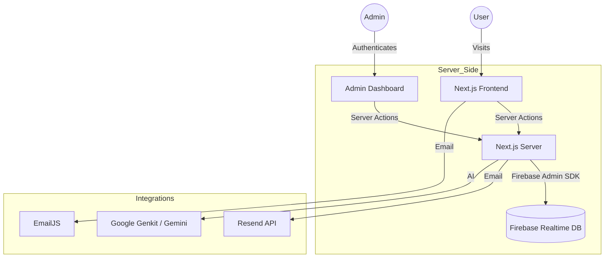

# 🚀 ByteFolio

**ByteFolio** is a modern, high-performance, and highly customizable portfolio template designed for developers and creatives. It features a robust **Admin Panel** to manage your content dynamically without touching the code, integrated with **Firebase** and powered by **Next.js 15**.

---

## ✨ Features

- 🛠️ **Full Admin Dashboard**: Manage About Me, Skills, Projects, Education, and Certifications.
- 🤖 **AI-Ready**: Integrated with Google Genkit for AI-enhanced features.
- 🎨 **Modern UI/UX**: Built with Tailwind CSS, Shadcn UI, and smooth animations.
- 📊 **Real-time Analytics**: Tracks page views and contact messages.
- 📧 **Multiple Email Options**: Support for EmailJS (client-side) and Resend (server-side fallback).
- 🌓 **Dark/Light Mode**: Seamless theme switching.
- 📱 **Fully Responsive**: Optimized for all screen sizes.
- 🧊 **3D Elements**: Integration with Spline (Three.js) for immersive hero sections.

---

## 🛠️ Tech Stack

- **Framework**: [Next.js 15 (App Router)](https://nextjs.org/)
- **Language**: [TypeScript](https://www.typescriptlang.org/)
- **Styling**: [Tailwind CSS](https://tailwindcss.com/) + [Shadcn UI](https://ui.shadcn.com/)
- **Database**: [Firebase Realtime Database](https://firebase.google.com/docs/database)
- **Backend**: Next.js Server Actions + [Firebase Admin SDK](https://firebase.google.com/docs/admin/setup)
- **AI**: [Google Genkit](https://firebase.google.com/docs/genkit)
- **Charts**: [Recharts](https://recharts.org/)
- **Icons**: [Lucide React](https://lucide.dev/)
- **Deployment**: [Netlify](https://www.netlify.com/)

---

## 🏗️ Architecture



---

## 🚀 How It Works

1.  **Dynamic Content**: Instead of hardcoding your details, the app fetches data from Firebase. You can update your bio, add new projects, or change your resume link directly from the `/admin` dashboard.
2.  **Server Actions**: Securely handles all database operations (Create, Read, Update, Delete) using Next.js Server Actions, bypassing the need for complex API routes.
3.  **Security**: The database is secured using Firebase Admin SDK on the server, allowing you to set public rules to `read: false, write: false` while maintaining full app functionality.
4.  **AI Integration**: Uses Genkit to potentially enhance project descriptions or generate content hints.

---

## 📦 How to Use

### 1. Prerequisites
- Node.js 20+ installed.
- A Firebase project (https://console.firebase.google.com/).

### 2. Environment Variables
Create a `.env.local` file in the root directory:

```env
# Firebase Admin Credentials (Go to https://console.firebase.google.com/ and create a new project if you don't have one or the select the project and click on gear icon on left sidebar -> service Account -> Generate Private Key(under Admin SDK))
FIREBASE_PROJECT_ID=your-project-id
FIREBASE_CLIENT_EMAIL=your-client-email
FIREBASE_PRIVATE_KEY="your-private-key"
FIREBASE_DATABASE_URL=your-database-url

# Admin Auth
ADMIN_EMAIL=admin@example.com
ADMIN_PASSWORD=your-secure-password

# Optional Integrations
RESEND_API_KEY=re_xxx
CONTACT_FORM_RECIPIENT_EMAIL=your-email@example.com
NEXT_PUBLIC_GA_MEASUREMENT_ID=G-xxxxxxx
NEXT_PUBLIC_SITE_URL=https://your-domain.com
```

### 3. Installation
```bash
npm install
npm run dev
```
Open [http://localhost:9002](http://localhost:9002) to see the result.

### 4. Deployment
Deploy easily on **Netlify** or **Vercel**. Ensure you add the environment variables to your deployment settings.

---

## 🔒 Database Security
Set your Firebase Realtime Database rules to:
```json
{
  "rules": {
    ".read": false,
    ".write": false
  }
}
```
*The Admin SDK bypasses these rules, ensuring your data is private but your app remains functional.*

---

made with ❤️ by **kunal gupta**

[](https://ko-fi.com/kunalgupta25)
